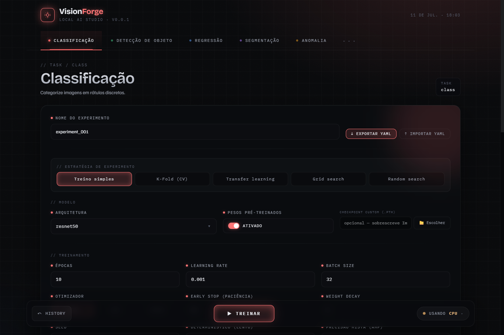
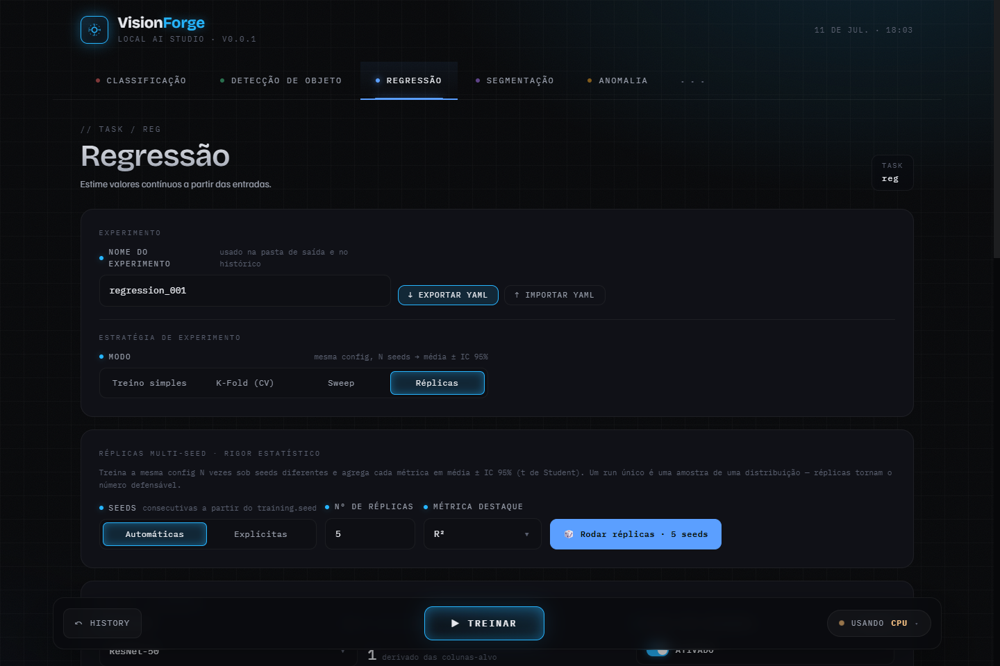

# VisionForge

[](https://github.com/marcus-vreis/VisionForge/actions/workflows/ci.yml)
[](LICENSE)

**A local-first computer-vision experimentation platform for researchers.**
Train, validate and compare models on your own GPU — no cloud, no notebooks,
no copy-pasted training loops. PyTorch + FastAPI + React in one Python process.

VisionForge replaces ad-hoc Jupyter workflows with a clean, testable, reproducible
system where the numbers you report are numbers you can defend: every run records
its full provenance, and every comparison can be replicated across seeds with
confidence intervals.



## Five task families, one interface

| Task | Models | Metrics |
|---|---|---|
| **Classification** | ResNet 18/34/50/101, EfficientNet B1/B7, VGG 16/19, AlexNet, timm, custom | Accuracy, F1, Precision, Recall, AUC-ROC, confusion matrix, ROC/PR curves |
| **Object detection** | Ultralytics YOLOv8/9/10/11/12/26, RT-DETR · torchvision Faster R-CNN, SSD, RetinaNet | mAP@50, mAP@50-95, box loss |
| **Image regression** | CNN backbones + linear head (CSV manifest datasets), timm, custom | MSE, RMSE, MAE, R² |
| **Semantic segmentation** | DeepLabV3, FCN, LR-ASPP, U-Net, custom | mean IoU, Dice, pixel accuracy |
| **Anomaly detection** | Convolutional autoencoder, PatchCore (unsupervised, MVTec-style) | image AUROC, threshold, F1 |
| **Your own task** (SDK) | any `nn.Module` — you write 4 hooks in one Python file | any metrics you declare (`higher`/`lower` direction-aware) |

Every task panel follows the same canonical layout: experiment name + YAML
export/import, a strategy selector, model, training, dataset (with pre-training
stats), preprocessing filters and augmentation with live preview.

## Built for defensible results



- **Multi-seed replicates** — train the same config N times under different
  seeds and report `metric = mean ± 95% CI` (Student-t) instead of a single
  point estimate.
- **K-fold cross-validation** — classification, regression and segmentation;
  per-fold metrics + mean ± std, with fold-leakage-safe transforms.
- **Hyperparameter sweeps** — grid, random, or Optuna TPE over any config field
  by dot-path; one-click architecture-comparison preset.
- **Paired significance testing** — compare N configurations over the *same*
  seeds and get the difference, its bootstrap CI, a paired t or Wilcoxon test
  (chosen and justified per comparison), Cohen's `d_z`, and Holm-Bonferroni
  correction across the family. It refuses to compare runs whose seeds do not
  line up, and flags when the seed count makes significance unreachable — so
  "not significant" is never mistaken for "no effect".
- **Paper-ready output** — every replicates / sweep / K-fold / comparison
  report is also written as a `booktabs` LaTeX table, with notes stating what
  each interval covers and which correction was applied.
- **Full provenance** — every run writes a versioned `run.json` with the exact
  config, seed, per-epoch history, environment (Python, torch/torchvision,
  numpy, CUDA, cuDNN, GPU model) and a **dataset fingerprint**, so "same data"
  is a checkable claim rather than a shared path.
- **Reproducibility knobs** — seeded runs, optional deterministic cuDNN mode,
  config schema versioning with migrations, YAML round-trip (export from the
  GUI, re-run from the CLI).
- **Post-training tooling** — run history with multi-run comparison and config
  diff, per-checkpoint testing on new datasets, batch prediction to CSV,
  Grad-CAM explainability, ONNX export with PyTorch-vs-runtime latency
  benchmark, TensorBoard scalars per run.
- **Dataset utilities** — split auto-detection, per-split stats (class balance,
  image/mask pairing, manifest checks with target distributions), one-shot
  download from torchvision / Roboflow / Kaggle / Hugging Face — see
  [`docs/DATASETS.md`](docs/DATASETS.md) for what each provider needs.

## Installation

Requirements: **Python 3.13+**. Node.js is only needed to build the frontend
from source — the published package already ships the built UI.

> **On PyPI the distribution is `visionforge-studio`** — the bare
> `visionforge` name belongs to an unrelated project. The import name, the CLI
> command and the project itself are still `visionforge`.

```bash
mkdir my-research && cd my-research    # one folder per project (see Workspace)
pip install "visionforge-studio[cu128]"
visionforge doctor
visionforge gui
```

The extra picks the torch build: `cu118` · `cu121` · `cu124` · `cu126` ·
`cu128` · `cpu`. `cu128` is the broadest — its kernels span Turing (sm_75)
through Blackwell (sm_120), and it is the only one that runs on an RTX
50-series card at all. Not sure which? Install the bare package first, run
`visionforge doctor`, and it prints the exact line for your machine — then
re-run the install with the extra it names.

### With Docker

Skips the PyTorch install entirely — the image carries a matching torch build.
The host needs the NVIDIA driver and `nvidia-container-toolkit`; an image
cannot ship those.

```bash
docker compose up            # GPU, GUI on http://localhost:8000
```

```bash
docker compose --profile cpu up      # machines without a GPU
```

`datasets/` is mounted read-only, `outputs/` read-write, and `user_models/` +
`user_tasks/` exactly as they work outside Docker — so runs, checkpoints and
your own code live on the host, not inside the image. Saved provider keys
persist in a named volume.

The default is CUDA 12.8, whose kernels span Turing through Blackwell. The
build is a build arg rather than a hardcoded base, so one Dockerfile serves
every supported version:

```bash
docker build \
  --build-arg CUDA_TAG=cu126 \
  --build-arg BASE_IMAGE=nvidia/cuda:12.6.3-runtime-ubuntu22.04 \
  -t visionforge:cu126 .
```

Change both args together: the wheel tag and the CUDA runtime it needs.

One difference inside the container: the native folder picker needs a display,
so it explains itself and you type the mounted path (`/work/datasets/...`)
instead.

### pip and Docker side by side

They are the same code and the same version — Docker only removes the PyTorch
install step. Pick per machine, not per project:

| | shared between the two | why |
|---|---|---|
| `outputs/` — runs, checkpoints, `run.json`, reports | **yes** | it is a mounted host folder, so a run trained via pip shows up in the Docker GUI's history and vice versa |
| `datasets/`, `user_models/`, `user_tasks/` | **yes** | also mounted from the host |
| saved provider API keys | **no** | pip keeps them in `~/.visionforge/credentials.json` on the host; the container keeps them in its own `visionforge-config` volume, so you save the key once per form (set `VISIONFORGE_HOME` to point elsewhere) |
| the run queue | **no** | it lives in the server process, so each running server has its own |

**Run one at a time.** Both serve port 8000, and both want the same GPU —
starting the container while a pip-installed server is training does not divide
the card between them, it just makes two processes compete for its memory.

### From source

For development, or to run an unreleased commit:

```bash
git clone https://github.com/marcus-vreis/VisionForge.git
cd VisionForge
uv venv
# Windows: .venv\Scripts\activate     Linux/macOS: source .venv/bin/activate
```

PyTorch is intentionally **not** a plain dependency — its build must match your
hardware, and a resolver cannot pick correctly between the CPU and CUDA wheels
(ADR-005). You choose one via a **hardware extra**, and the right index is
already wired up for it:

```bash
uv pip install -e ".[cu128,dev]"    # NVIDIA CUDA 12.8 — widest GPU coverage
# also available: cu118 · cu121 · cu124 · cu126 · cpu
```

Not sure which? Ask, and it prints the exact line for your machine:

```bash
visionforge doctor
```

It reads your driver *and* any torch already installed, so on a machine whose
GPU works it says so instead of recommending a downgrade.

Build the web UI once (it is then served by the Python backend — end users
never need Node):

```bash
cd frontend && npm install && npm run build && cd ..
```

Check the install actually works before pointing it at your data:

```bash
visionforge --version
visionforge selftest --quick     # trains every task on synthetic data, ~15s
```

### Optional extras

| Extra | Enables |
|---|---|
| `detection` | Ultralytics YOLO / RT-DETR backends |
| `timm` | hundreds of extra backbones via `model.timm_model` |
| `optuna` | TPE-guided sweeps (`mode="optuna"`) |
| `tensorboard` | per-epoch scalars under `<run_dir>/tensorboard/` |
| `roboflow` / `kaggle` / `huggingface` | one-shot dataset download providers |

```bash
uv pip install -e ".[detection,optuna,tensorboard]"
```

## Quickstart

> New here? The step-by-step walkthrough — install → built-in dataset download
> → first run → replicates with confidence intervals → YAML re-run — lives in
> [`docs/QUICKSTART.md`](docs/QUICKSTART.md).

**GUI** (recommended):

```bash
visionforge gui           # opens http://127.0.0.1:8000
```

Pick a task tab, point the dataset picker at your data (stats render
immediately), choose a strategy — single run, K-fold, sweep or replicates —
and press *Treinar*. A live monitor streams epochs; results land in the run
history with plots, markdown model cards and artifact paths.

**CLI** (automation):

```bash
visionforge run configs/baseline.yaml        # classification
visionforge run configs/detection.yaml       # any task — dispatched by config
```

Configs exported from the GUI are the exact wire payload, so they re-run
identically from the CLI. All artifacts (checkpoints, plots, `run.json`,
reports) are written under `outputs/`.

## Your workspace

VisionForge looks for your own models and tasks in folders **next to wherever
you run it** — no repository needed, and nothing to edit inside the package:

```
my-research/            ← run `visionforge gui` from here
├── user_models/        ← your architectures  (see below)
├── user_tasks/         ← your task families  (`visionforge new-task`)
├── datasets/           ← whatever you point the picker at
└── outputs/            ← runs, checkpoints, reports, run.json
```

`visionforge doctor` prints the exact resolved paths, so you can always see
where it is looking. Run it from a different folder and it looks there instead
— pick one working directory per project and stay in it.

## Custom models

Drop a Python file into `user_models/` and register it:

```python
from visionforge.models.registry import register_model

@register_model("my_net")
def build_my_net(num_outputs: int) -> nn.Module: ...
```

Select it via `model.custom_model` — works for classification, regression and
segmentation. See `user_models/README.md`.

## Custom tasks — define a whole new task family (ADR-058)

When your research doesn't fit the five built-in tasks, define your own in
**one documented Python file** — no React, no FastAPI, no training loop:

```bash
visionforge new-task cell_counting     # writes user_tasks/cell_counting.py
```

The generated template **trains out of the box** on synthetic data. Fill four
hooks — `build_model`, `build_loaders`, `compute_loss`, `compute_metrics` —
and a Pydantic `Config` whose fields become a validated form schema. You get,
with zero extra code:

- `GET /api/tasks` · `GET /api/custom/<key>/schema` · `POST /api/custom/<key>/run`
  (live SSE monitor, TensorBoard, versioned `run.json` provenance)
- `POST /api/custom/<key>/sweep` — grid/random/Optuna over **any** config
  field, including the ones you declared
- `POST /api/custom/<key>/replicates` — N seeds → mean ± std ± 95% CI

Training not epoch-shaped (GANs, EM loops)? Override `run(cfg, ctx)` and own
the loop while keeping every contract. A working example ships in
`user_tasks/example_counting/` (a CNN counting dots in synthetic images —
trains in seconds on CPU). Full walkthrough: [`user_tasks/README.md`](user_tasks/README.md) (PT + EN).

## Verifying the install

`visionforge doctor` checks your environment; **`visionforge selftest` checks
the pipeline** — it builds tiny synthetic datasets, starts the real API, and
trains every task through the same endpoints the browser uses, asserting that
each run completes, streams live progress, and stores its report:

```bash
visionforge selftest --quick     # one run per task (~15s, CPU, offline)
visionforge selftest             # every task x strategy: simple, K-fold, sweep, replicates, comparison
```

```
case                       result    time  detail
classification/replicates  PASS      2.7s  accuracy=1.0000±0.0000
segmentation/cv            PASS      2.0s  miou=0.0783
custom/sweep               PASS      0.6s  best mae=2.4231
regression/comparison      PASS      6.5s  best=baseline 1/1 signif.
...
27/27 cases passed
```

Filters: `--tasks classification,custom`, `--strategies sweep,replicates`,
`--json out.json`. Exit code is non-zero if any case fails, so it drops into
CI as-is. It verifies integrity, not model quality — one epoch on synthetic
data says nothing about accuracy.

## Status

**v0.1.0 — first public release.** Usable for real work and under active
development. Below 1.0 the config schema and HTTP API may change between minor
releases; configs carry a `schema_version` and are migrated on load, so a YAML
exported from an older release keeps working.

Verified, not asserted: 1370 backend tests and 121 frontend tests gated in CI,
plus a full matrix of 21 (task × strategy) cases trained on **real** datasets —
the corpus, the numbers and the one defect it caught are in
[`documentation/VALIDATION.md`](documentation/VALIDATION.md).

Known limits worth knowing before you start:

- **One training at a time — but submissions queue.** The card runs one job;
  extra submissions line up and start on their own as it frees, so you can
  stack an evening's experiments and leave (ADR-075). The bottom bar shows
  `⧗ fila N` when something is waiting, and a job that has not started yet can
  be dropped. A job already training cannot be cancelled: the trainers have no
  stop point, and interrupting one would leave a half-written run directory.
  The queue lives in the server process, so restarting the server clears what
  had not started.
- **One-click dataset download covers classification only** (the torchvision
  built-ins produce an `ImageFolder`). Detection, regression, segmentation and
  anomaly need a dataset already in their layout — see
  [`documentation/TRAINING_PLAN.md`](documentation/TRAINING_PLAN.md).
- **No K-fold for detection or anomaly**, by design: Ultralytics owns its
  training loop, and an unsupervised validation fold without anomalies measures
  nothing.
- **Windows**: keep `training.workers` at 0–2. Each DataLoader worker is a
  process that reloads torch's CUDA DLLs, and eight of them exhaust the page
  file (`WinError 1455`). The default is already 2 there.
- Dark theme only; a light palette is not designed yet.

Found something? [Open an issue](https://github.com/marcus-vreis/VisionForge/issues/new/choose)
— the template asks for `visionforge --version` and `visionforge doctor`, which
answers most of the questions up front.

## Architecture, decisions and contributing

- [`CHANGELOG.md`](CHANGELOG.md) — what shipped in each release
- `documentation/ARCHITECTURE.md` — layers, modules, boundaries
- `documentation/DECISIONS.md` — every architecture decision as an ADR (001–065)
- `documentation/TRAINING_PLAN.md` — the model × strategy matrix, in four
  layers of increasing cost
- `documentation/VALIDATION.md` — the real-dataset validation record
- `documentation/CONTRIBUTING.md` — dev setup, test/lint gauntlet, PR flow
- `documentation/RELEASING.md` — how a version gets cut and published

Backend checks: `pytest` · `ruff check src/ tests/` · `mypy src/`.
Frontend: `cd frontend && npx vitest run && npm run typecheck`.
End-to-end: `visionforge selftest` (or `pytest -m slow` for the harness's own
live cases — they are deselected from the default run).

## Citing

If VisionForge is useful in your research, please cite it — see
[`CITATION.cff`](CITATION.cff) (GitHub renders a “Cite this repository” button).

## License

[MIT](LICENSE)
